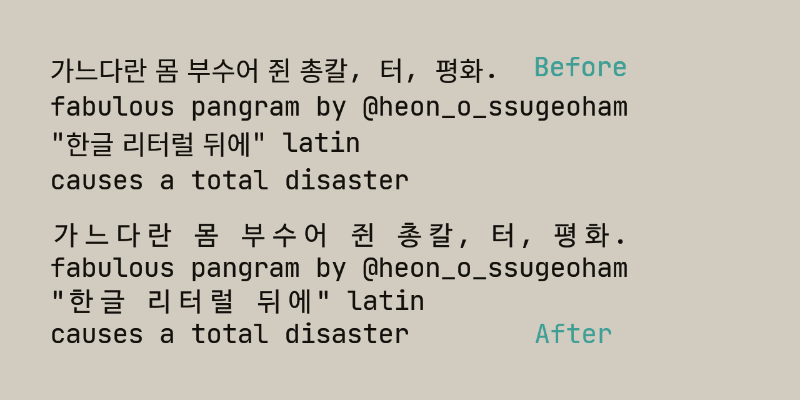

# JBD2 - JetBrains Mono Hangul


이 프로젝트 **JBD2**는 **JetBrains Mono**와 **D2Coding**의 장점을 결합했습니다. JetBrains Mono에 D2Coding의 한글 영역(U+3131-U+318E, U+AC00-U+D7A3)을 덧씌운 뒤 최적의 가독성을 위해 글자 폭을 조정했습니다. 또한 vim을 위한 **Nerd Fonts**도 포함되어 있습니다.

"JetBrains Mono Hangul"의 원작자인 서장협님은 원래 이름을 "JetBrains D2"로 지으려 했으나, D2Coding의 RFN 라이선스 때문에 "JetBrains Mono Hangul"로 명명했다고 말씀하셨습니다. 하지만 저는 개인적인 편의와 VS Code와 같은 에디터에서의 쉬운 사용을 위해 이 버전을 `JBD2`로 임의로 변경하여 배포합니다.

> 만약 이 이름 변경으로 인해 문제가 발생한다면 추후 수정하도록 하겠습니다.

-----

## 폰트 다운로드



[release](https://github.com/partrita/JBD2/releases) 페이지에서 `ttf` 파일들을 직접 다운로드할 수 있습니다. 파일명에 포함된 용어에 대한 설명은 아래를 참고하세요.

  * `JBD2-Regular.ttf`: **일반 글꼴**입니다. 주로 이 파일을 사용하시면 됩니다.
  * `JBD2-Regular.woff2`: **웹폰트** 용도에 적합합니다.
  * `JBD2NF-Regular.ttf`: **NF**는 **Nerd Font**의 약자로, 일반 폰트와 다양한 아이콘 글리프를 포함합니다.
  * `JBD2NFM-Regular.ttf`: **NFM**은 **Nerd Font Mono**의 약자로, 고정폭 폰트를 의미합니다.
  * `JBD2NFP-Regular.ttf`: **NFP**는 **Nerd Font Proportional**의 약자로, 비등폭 글꼴을 의미합니다. 일반적인 텍스트, GUI, 프레젠테이션 등 문자의 폭이 다른 경우에 적합합니다.
  * `JBD2NL-Regular.ttf`: **NL**은 **No Ligatures**를 의미합니다. 개발자를 위해 디자인된 JetBrains Mono에서 합자(ligature) 기능이 제거된 버전입니다.


## 직접 빌드하기

**Docker**를 사용하여 직접 빌드하는 방법은 아래와 같습니다.

1.  먼저 **저장소를 복제**하고 **Docker 이미지를 빌드**합니다(이미지 이름을 `JBD2`로 지정):

    ```bash
    gh repo clone partrita/JBD2
    cd JBD2
    docker build -t JBD2 .
    ```

2.  빌드된 Docker 이미지를 인터랙티브 모드로 **실행**합니다:

    ```bash
    docker run -it -v "$(pwd)":/app JBD2
    ```

3.  Docker 컨테이너 안에서 다음 명령어를 실행할 수 있습니다:

      * `python build.py all`: 자동으로 설정하고 폰트를 빌드합니다.
      * `python build.py setup`: 필요한 폰트 파일을 다운로드하고 압축을 해제합니다.
      * `python build.py build`: 폰트를 병합하고 최종 결과물을 출력합니다.
      * `python build.py clean`: 다운로드된 파일과 출력 파일을 모두 삭제합니다.


## Config 설명

`config.py` 파일에는 폰트 빌드 프로세스를 제어하는 여러 변수가 정의되어 있습니다. 각 변수의 의미는 다음과 같습니다:

  * `D2_CODING_VERSION`: 사용할 D2Coding 폰트의 버전을 지정합니다.
      * 예시: `'1.3.2'`
  * `D2_CODING_DATE`: D2Coding 폰트 버전의 릴리즈 날짜입니다.
      * 예시: `'20180524'`
  * `D2_CODING_URL`: D2Coding 폰트 zip 파일을 다운로드할 URL입니다. 이 값은 `D2_CODING_VERSION`과 `D2_CODING_DATE`에 따라 **자동으로 생성**됩니다.
  * `D2_CODING_ZIP_NAME`: D2Coding 폰트 zip 파일을 다운로드할 때 사용할 파일명입니다.
      * 예시: `'D2_Coding.zip'`
  * `D2_CODING_WIDTH`: 사용할 D2Coding 폰트의 글자 폭(advance width) 값입니다.
      * 예시: `1000`
  * `JETBRAINS_MONO_VERSION`: 사용할 JetBrains Mono 폰트의 버전을 지정합니다.
      * 예시: `'2.304'`
  * `JETBRAINS_MONO_URL`: JetBrains Mono 폰트 zip 파일을 다운로드할 URL입니다. 이 값은 `JETBRAINS_MONO_VERSION`에 따라 **자동으로 생성**됩니다.
  * `JETBRAINS_MONO_ZIP_NAME`: JetBrains Mono 폰트 zip 파일을 다운로드할 때 사용할 파일명입니다.
      * 예시: `'JetBrains_Mono.zip'`
  * `JETBRAINS_MONO_WIDTH`: 사용할 JetBrains Mono 폰트의 글자 폭(advance width) 값입니다.
      * 예시: `1200`
  * `DOWNLOAD_PATH`: 폰트 빌드에 필요한 파일(예: zip 파일, 임시 폴더 등)을 저장할 기본 경로입니다.
      * 예시: `'assets'`
  * `BUILT_FONTS_PATH`: 빌드가 완료된 폰트 파일(TTF, WOFF2 등)을 저장할 경로입니다.
      * 예시: `'built_fonts'`
  * `BUILT_FONT_FILENAME_BASE`: 빌드된 폰트 파일의 기본 이름(접두사)입니다.
      * 예시: `'JBD2'`
  * `USE_SYSTEM_WGET`: 외부 시스템의 `wget` 명령어를 사용할지 여부를 지정합니다.
      * 예시: `False` (내장 Python 모듈 사용)
  * `DOWNLOAD_JETBRAINS_TTF_PATH`: JetBrains Mono zip 파일을 풀었을 때, TTF 파일들이 위치하는 경로입니다.
      * 예시: `'assets/fonts/ttf'`
  * `SOURCE_D2_CODING_FONT_PATH`: D2Coding 폰트의 TTF 파일이 위치하는 경로입니다.
      * 예시: `'assets/D2Coding/D2Coding-Ver1.3.2-20180524.ttf'`


## 감사 인사

코딩하면서 한글 주석이 어색하게 보이는게 항상 불만이었는데, 이 문제를 해결해주신 **서장협님**(jhyub06@gmail.com)께 진심으로 감사드립니다.

## 라이선스

이 프로젝트는 **OFL(Open Font License)** 하에 배포됩니다. 자세한 내용은 `LICENSE` 파일을 참조해주세요.
