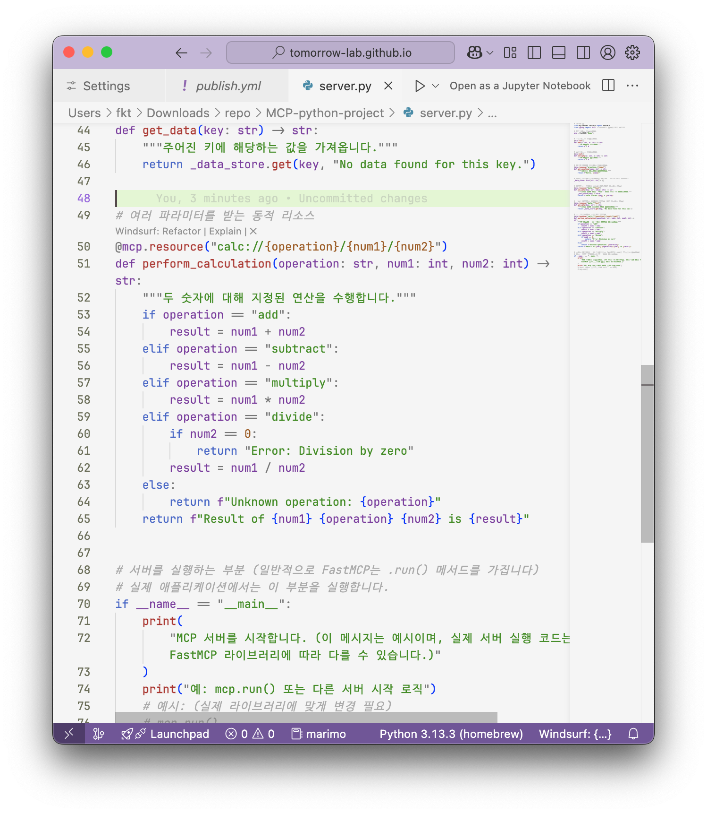
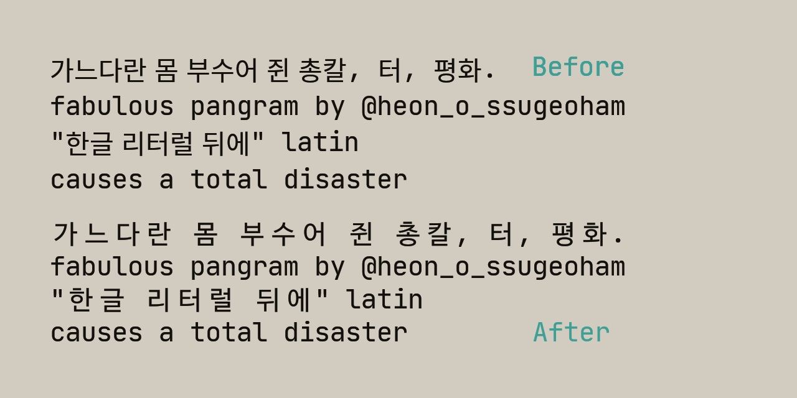

# JBD2 - JetBrains Mono Hangul




이 프로젝트 JBD2는 JetBrains Mono와 D2Coding의 장점을 결합했습니다. JetBrains Mono에 D2Coding의 한글 영역(U+3131-U+318E, U+AC00-U+D7A3)을 덧씌운 뒤 최적의 가독성을 위해 글자 폭을 조정했습니다. 또한 nvim을 위한 Nerd Fonts도 포함되어 있습니다.

"JetBrains Mono Hangul"의 원작자인 서장협님은 원래 이름을 "JetBrains D2"로 지으려 했으나, D2Coding의 RFN 라이선스 때문에 "JetBrains Mono Hangul"로 명명했다고 말씀하셨습니다. 하지만 저는 개인적인 편의와 VS Code와 같은 에디터에서의 쉬운 사용을 위해 이 버전을 `JBD2`로 임의로 변경하여 배포합니다.

> 만약 이 이름 변경으로 인해 문제가 발생한다면 추후 수정하도록 하겠습니다.

-----

## 폰트 다운로드



[release](https://github.com/partrita/JBD2/releases) 페이지에서 `ttf` 파일들을 직접 다운로드할 수 있습니다.

  * `JBD2-Regular.ttf`: 일반 글꼴입니다.
  * `JBD2-Regular.woff2`: 웹폰트용입니다.
  * `JBD2NF-Regular.ttf`: Nerd Font 아이콘이 포함된 버전입니다.
  * `JBD2NF-Regular.woff2`: Nerd Font 웹폰트용입니다.

## 직접 빌드하기

이 프로젝트는 [uv](https://github.com/astral-sh/uv)를 사용하여 파이썬 의존성을 관리합니다.

### 요구 사항
- `fontforge`: 시스템에 설치되어 있어야 합니다. (Linux: `sudo apt install fontforge python3-fontforge`)
- `uv`: 파이썬 패키지 관리를 위해 필요합니다.

### 빌드 단계
1.  저장소를 복제합니다.
    ```bash
    git clone https://github.com/partrita/JBD2.git
    cd JBD2
    ```

2.  의존성을 설치하고 폰트를 빌드합니다.
    ```bash
    # 모든 과정(설정, 다운로드, 빌드) 자동 수행
    uv run python -m src.build all
    ```

### 개별 명령어
- `uv run python -m src.build setup`: 필요한 폰트 파일을 다운로드하고 압축을 해제합니다.
- `uv run python -m src.build build`: 폰트를 병합하고 최종 결과물을 `built_fonts/` 폴더에 생성합니다.
- `uv run python -m src.build clean`: 다운로드된 파일과 출력 파일을 삭제합니다.

## 감사 인사

코딩하면서 한글 주석이 어색하게 보이는게 항상 불만이었는데, 이 문제를 해결해주신 서장협님(jhyub06@gmail.com)께 진심으로 감사드립니다.

## 라이선스

이 프로젝트는 OFL(Open Font License) 하에 배포됩니다. 자세한 내용은 `LICENSE` 파일을 참조해주세요.
